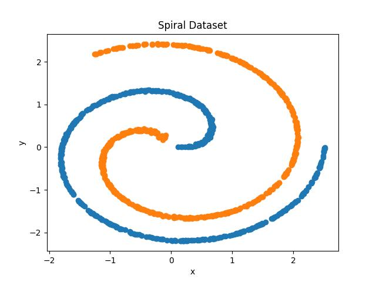
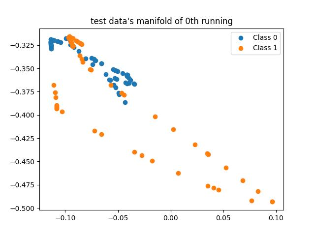
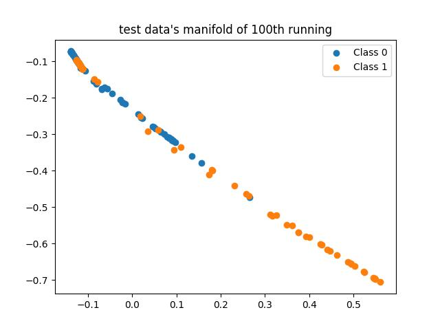
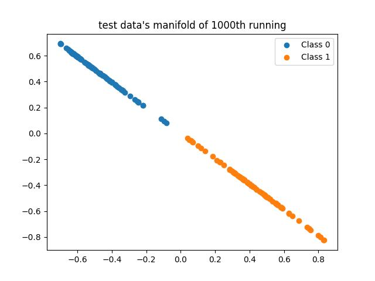
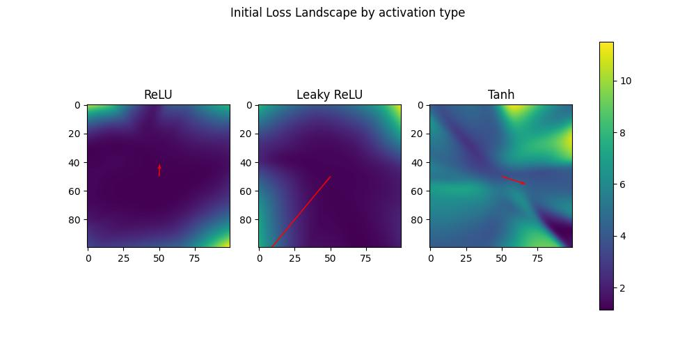
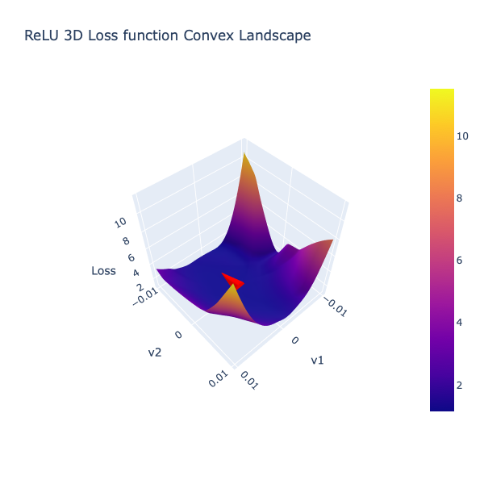
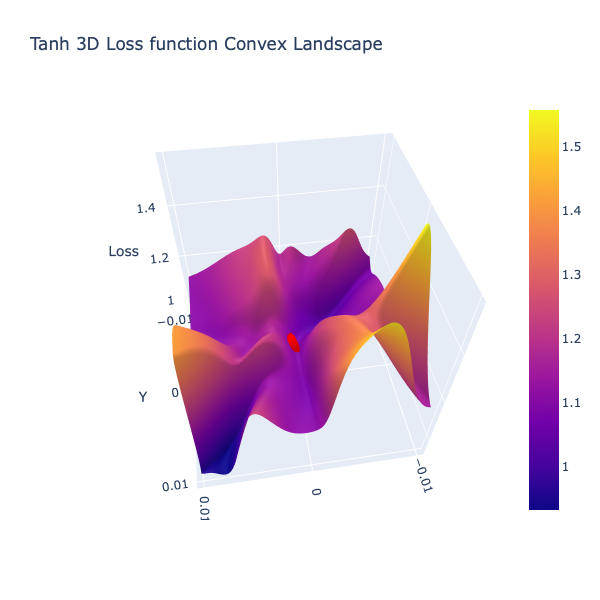

## **Week01: 딥러닝 들어가기**

1. 수학적 이해: 비선형성, 오차역전파, MLE, 손실 함수, representation learning
2. 왜 단순한 행렬곱과 비선형성만으로는 chatgpt와 같이 복잡한 학습이 어려운가?: inductive bias에 대하여(CNN, RNN, attention mechanism) + Loss surface
3. ANN의 문제를 어떻게 해결했는가?: normalization, regularization, optimizing, architecture

### further reading:

#### _[Manifold](./week01/manifold_study.ipynb) Visualization_

다음과 같이 선형 함수로 근사하기 어려운 데이터를 처리하기 위해 필요한 것은 비선형 함수(흔히 activation이라 불림)이다. 이 비선형 함수들의 중첩을 통해서 마지막 헤드가 판별하기 쉽게 데이터의 형태를 변화시키는 과정을 아래 실험에서 확인할 수 있다.

아래는 마지막 선형 변환 이전의 2차원 데이터의 시각화 결과이다. feature을 구별하기 위해서 본래 space의 distortion을 거쳐 다음과 같은 분리가 이루어진 것을 확인할 수 있다.

| 0th                                    | 100th                                    | 1000th                                    |
| -------------------------------------- | ---------------------------------------- | ----------------------------------------- |
|  |  |  |

우리가 지구에 살때 위도, 경도 두 개의 변수만으로 위치를 표현할 수 있는 것처럼 다음과 같이 복잡한 데이터를 원 좌표계에서 바라보는 것보다 이를 저차원으로 매핑하거나 왜곡된 좌표계에서 바라보는 것이 판단에 용이할 것이다.

-> 데이터의 숨겨진 모양을 찾아나가는 것!

_궁금증을 가질만한 질문들_

1. boundary의 문제: 어딜 경계로 두 데이터가 나누어지는지 (hallucination+bayes optimization)
    - P(Y, X)/P(X) vs P(Y|X)
2. 일반화는 어떻게 이루어지는거지?: test set의 비율을 조정하면서 실험해보기
3. 좌표계를 그렇게 왜곡시켰는데 파라메터 공간에 대해서 일반적인 GD를 쓸 수 있나?: Riemmanian metric+Natural Gradient

#### [Loss surface](./week01/loss_surface.ipynb) visualization of your model! (why residual connection is GOD.)

GD를 직관적으로 이해하기 위해 parameter space에서 정의되는 loss function을 생각해보자. 특정 parameter 벡터가 입력되면 loss 값이 출력으로 나오는 function 말이다. 특정 시점에서 parameter 입력이 주어졌을 때 우리는 loss가 최소화되는 지점에 다다르고 싶어한다. 모든 parameter space에 대한 탐색은 costy하고 in-tractable하기 때문에 iteration을 거듭하면서 더 나은 결과를 기대한다. 이때 Backpropagation은 loss에 대한 gradient를 chain rule로 효율적으로 계산하는 방법이고, Gradient Descent는 그 gradient의 반대 방향으로 parameter를 조금씩 update하는 최적화 규칙이다.

위의 그림은 2차원보다 큰 parameter space에서 [loss surface를 시각화하는 방법에 대해서 제시한 논문](https://arxiv.org/pdf/1712.09913)을 참고하여 구현한 것이다. 그림의 (50, 50)은 parameter space의 원점이 아니라, 기준이 되는 학습된 parameter 벡터를 2개의 방향 벡터가 만드는 평면 위에 놓았을 때의 중앙 좌표에 가깝다. 주변 격자는 그 기준 parameter에 두 방향의 perturbation을 더하고 빼며 얻은 loss 값이다. '지형이 고른 형태를 보일수록 안정적인 학습이 가능할 것이다.'와 같이 loss surface의 시각화를 통해서 여러 정보를 얻을 수 있다. 아래는 이 그림을 3차원으로 나타낸 것이다. gradient는 loss가 가장 빠르게 증가하는 방향이고, 학습 update는 보통 그 반대 방향(-gradient)으로 움직인다.(수학적인 방법이 궁금하다면 loss function을 스칼라 출력을 내는 벡터 함수라고 생각한 후에 이의 gradient vector을 생각해보기를!)

| ReLU                             | Tanh                             |
| -------------------------------- | -------------------------------- |
|  |  |

_궁금증을 가질만한 질문들_

1. GD는 결정론적인가?: random seed 등의 값이 똑같다면 학습 과정의 randomness는 없다. 모든 데이터셋을 한 배치로 훈련시키기 때문이다. -> SGD(Stochastic+GD)이 더 효율적인 이유가 무엇일까?
2. SGD의 loss surface는?: SGD는 배치의 샘플링 과정을 통해서 통계적 안정성을 얻을 수 있다. 위의 상황처럼 GD의 loss surface의 경우와 다르게 SGD의 경우는 어떻게 해석해야 할까?
3. training dataset vs test dataset -> 서로 loss surface가 어떻게 다를까?

#### Related Resources

-   [Loss Surface](https://arxiv.org/pdf/1712.09913)
-   [Capsule nets](https://medium.com/ai³-theory-practice-business/understanding-hintons-capsule-networks-part-i-intuition-b4b559d1159b)
-   [How Embedding Works](https://github.com/colah/NLP-RNNs-Representations-Post/blob/master/index.md)
-   [Gradient Vector](https://en.wikipedia.org/wiki/Gradient)
-   [What is convolution](https://www.youtube.com/watch?v=KuXjwB4LzSA)
-   [Visualization by cs231n](https://www.youtube.com/watch?v=ta5fdaqDT3M)

## **Week02: 역사를 훑다**

1. 시퀀스를 이해하는 방법: Markov Process, RNN, Residual Mapping, Forget Gate
2. About language: Language level(0~3), combining Low-entropy pair(BPE, tokenizers..)
3. Attention is all you need: Let you know your Pos!, Give you a Context!
4. Topology on Linear Projection: Whitney-Embedding theorem

### further reading:

#### Why positional embedding(arbitrary/absolute) shapes Helix?

...

#### Expands Whitney-Embedding Theorem!

...

#### Related Resources

-   [The Unreasonable Effectiveness of Recurrent Neural Networks](https://karpathy.github.io/2015/05/21/rnn-effectiveness/)
-   [Identity mapping Cited by 13741](https://arxiv.org/pdf/1603.05027) ---> Quite neat prescription!
-   [Soft-Attention](https://www.youtube.com/watch?v=ByjaPdWXKJ4&list=PLkt2uSq6rBVctENoVBg1TpCC7OQi31AlC&index=14)
-   [Language, as distil by me](https://blog.naver.com/yoonhero06/223749063877)
-   [It's Topology! you have to go back to Math](https://colah.github.io/posts/2014-03-NN-Manifolds-Topology/)

### **About HW(숙제)**

difficult mnist by me!

About dataset

-   이미지 크기 (3x64x64)입니다.
-   3가지 색깔로 이루어진 펜으로 5가지 질감과 색이 다른 종이에 쓰인 숫자를 맞춰야 합니다.
-   숫자는 0-9로 구성되어 있습니다.
-   숫자의 위치는 랜덤하게 설정되었고, 숫자의 크기 도한 랜덤하게 설정되었습니다.

## **Week06~07: PT time**

Strengthen your sight.

Go to [here](./week06) for more informations!

## **Summer Week01: Convolution**

1. Convolution 연산에 대한 이야기: X+Y, CLT,
2. 사람의 정보 처리 시스템에 대한 이야기: The Unbearable Slowness of Being: Why do we live at 10 bits/s?
3. CNN Design에 대한 이야기: Stride instead of Pooling, Dilation for Dense Classification

### further reading:

-   [But What is a convolution](https://www.youtube.com/watch?v=KuXjwB4LzSA)
-   [Understanding Convolutions](https://colah.github.io/posts/2014-07-Understanding-Convolutions/)
-   [The Unbearable Slowness of Being: Why do we live at 10 bits/s?](https://arxiv.org/pdf/2408.10234)
-   [Identity Mapping](https://arxiv.org/pdf/1603.05027)
-   [Alexnet](https://karpathy.github.io/2022/03/14/lecun1989/)
-   [Early deeplearning without CUDA](https://www.perplexity.ai/search/please-let-me-know-the-case-in-0yL55SLBSjyEmFddC1kAkw#3)
-   [BDE(before deeplearning era)](https://www.youtube.com/watch?v=NfnWJUyUJYU&list=PLkt2uSq6rBVctENoVBg1TpCC7OQi31AlC)

## **Summer Week02**

1. Story about RNN
2. RNN Regularization: How to bring dropout into RNN without instability.
3. Neural Turing Machine: Linguistic&Cognitive Science, Theory Of Computation, Focusing on Content&Location, Hard or Soft attention.

### further reading:

-   [Experiments on NTM](https://arxiv.org/pdf/1410.540)
-   [TOC in a nutshell](https://www.geeksforgeeks.org/theory-of-computation/introduction-of-theory-of-computation/)
-   [알고리즘과 튜링기계](http://www.aistudy.com/ai/algo_turing.htm)
-   [Neural Geometry](https://www.youtube.com/watch?v=QHj9uVmwA_0)

## **Summer Week03**

1. Deep speech 2: Audio Data, CTC Loss, engineering stuff
2. RNN Regularization: How to plug Dropout on LSTM?

## **Summer Week04**

1. Pointer Network: How to solve discrete-combinational problem? -> pointing the input
2. Set2Set: **Orders Matteres** -> prove there is easy to learn order.
3. Relational Network: The essence of intelligence is **connecting the dots**.(Steve Jobs?)
