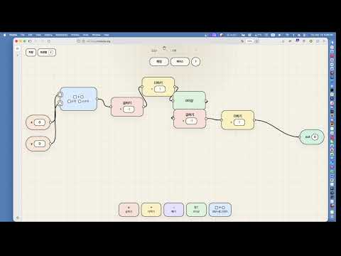
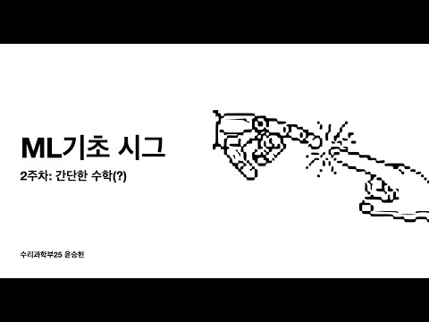
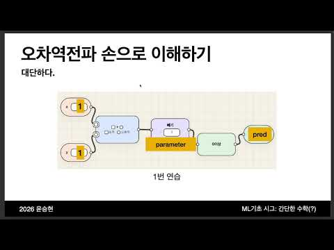
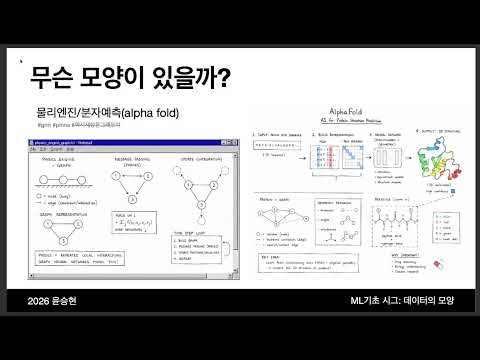
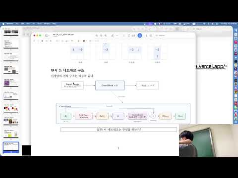
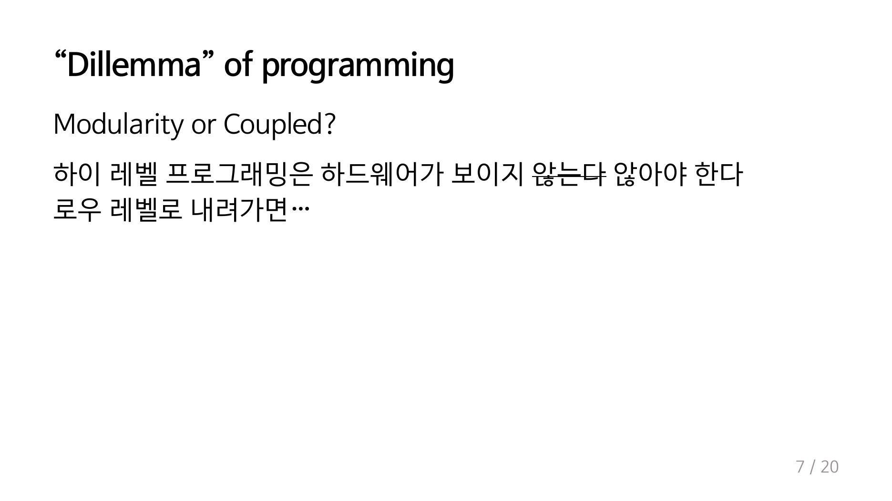
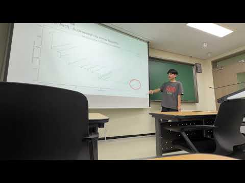

# 2026-1학기 ML 기초 SIG 활동보고서

## 1. 활동 개요

ML 기초 SIG는 인공지능과 머신러닝에 관심이 있는 학생들이 ChatGPT와 같은 현대 AI 시스템을 단순한 "마법"으로 받아들이는 데서 그치지 않고, 그 이면의 계산 원리와 학습 구조를 함께 이해하기 위해 운영한 학습 모임이다.

본 SIG에서는 개별 아키텍처나 훈련 기법을 단편적으로 나열하기보다, 계산 그래프, 손실 함수, 오차역전파, 행렬 표현, 데이터의 구조, inductive bias, 시각화, GPU 최적화 등을 하나의 흐름 안에서 연결해 다루었다. 이를 통해 참여자들이 머신러닝 모델을 보다 구조적으로 이해하고, 이후 심화 학습이나 프로젝트로 확장할 수 있는 기반을 마련하는 것을 목표로 하였다.

- 활동명: ML 기초 SIG
- 활동 기간: 2026학년도 1학기
- 총 참여 인원: 88명
- 주차별 주요 참여 규모: 1주차 약 40명, 2주차 약 20명, 3주차 약 10명
- 활동 기록: 주차별 라이브 및 발표 영상은 [Yoonhero YouTube 채널](https://www.youtube.com/@yoonhero3701)에 아카이브
- 활동 자료: 주차별 발표 PDF, 실습 자료, 인터랙티브 자료를 [GitHub 저장소](https://github.com/yoonhero/sig_archive/tree/main/ML_Basic_26_1)에 정리

## 2. 주차별 활동 내용

### 1주차: `__init__`

1주차에는 ML 기초 SIG의 전체 방향성을 소개하고, 인공지능을 "마법"이 아닌 계산 가능한 구조로 이해하기 위한 출발점을 잡았다. 명령형 프로그래밍과 선언형 프로그래밍의 차이를 비교하며, 현대 AI 시스템이 입력을 받아 출력을 생성하는 과정을 어떻게 바라볼 수 있는지 논의하였다.

또한 학습 과정을 `loss 정의 -> gradient 계산 -> optimizer update`라는 기본 loop로 정리하고, toy game을 통해 간단한 회로를 직접 구성해보았다. 과제로는 4개의 원소를 정렬하는 구조를 직접 만들어보며, 규칙을 손으로 설계하는 과정과 학습 가능한 구조를 만드는 과정의 차이를 체감하도록 하였다.

### 2주차: 간단한 수학(?)

2주차에는 1주차 과제였던 XOR/SORT 구조를 리뷰하며, 손으로 설계한 회로가 어떤 방식으로 동작하는지 점검하였다. 예측값과 정답의 차이를 손실 함수로 정의하고, 오차를 파라미터에 전달해 업데이트하는 gradient descent의 기본 원리를 다루었다.

특히 각 블록의 backward 연산을 직접 구현하거나 계산해보며, 오차역전파가 단순한 공식이 아니라 모델 내부에 정보를 전달하는 절차임을 확인하였다. 과제로는 "오차역전파로 관악산을 등반하라"는 문제를 통해, gradient를 이용한 이동과 최적화 과정을 직관적으로 이해하도록 구성하였다.

### 3주차: 이 노가다를 끝내러 왔다. (행렬)

3주차에는 1-2주차에 손으로 연결하던 회로를 행렬과 벡터로 표현하는 방법을 학습하였다. 선형 변환, bias, ReLU, loss, parameter update를 계산 그래프와 선형대수 관점에서 연결하며, 신경망의 기본 구성요소가 수식으로 어떻게 표현되는지 정리하였다.

또한 AND/XOR 학습지를 통해 순전파, 손실 계산, gradient 계산, 파라미터 업데이트를 직접 수행하였다. 과제로는 `x in R^4`에서 정렬과 중앙값을 구현하고, 입력에 대한 손실의 기울기를 해석하는 문제를 다루었다.

### 4주차: 데이터, 어떻게 생겼니

4주차에는 단순히 행렬을 깊게 쌓는 것만으로는 데이터의 구조와 대칭성을 충분히 활용하기 어렵다는 문제를 다루었다. 이미지 데이터의 평행이동 대칭성을 예시로 convolution의 의미를 설명하고, translation equivariance와 pooling을 통한 invariance를 소개하였다.

또한 local receptive field, shared weight, group convolution, D4 symmetry 등의 개념을 통해 데이터의 모양에 맞는 inductive bias를 설계하는 방법을 논의하였다. 과제로는 상하좌우가 이어진 이미지 구조에 적합한 CNN 구조를 스케치하는 활동을 진행하였다.

### 5주차: 보고, 듣고, 맛보고, 질문하자

5주차에는 4주차 과제의 해답으로 circular padding, periodic CNN, D4 변환 등을 살펴보며 데이터 구조를 모델에 반영하는 방법을 구체화하였다. 이어서 모델 학습 결과를 loss 하나로만 판단하지 않고, 예측값, weight/kernel, activation, feature space, saliency map, adversarial example 등을 함께 시각화해야 하는 이유를 다루었다.

CNN 필터와 Gabor filter의 관계, activation saturation과 gradient vanishing, DeepDream, SmoothGrad, Integrated Gradients 등 모델 내부를 관찰하고 해석하는 여러 관점을 소개하였다. 과제로는 주어진 convolution 필터와 네트워크 구조가 수행하는 task를 역추론하는 "시각화 고고학" 활동을 진행하였다.

### 6주차: Introduction to GPU Optimization

6주차에는 5주차 과제 해답으로 circular convolution과 DFT 관점을 정리한 뒤, 머신러닝 모델이 실제 하드웨어 위에서 어떻게 실행되는지를 다루었다. CPU와 GPU의 구조적 차이, thread-block-grid 실행 모델, register/shared/global memory 계층을 소개하고, 연산 성능을 이해하기 위한 roofline model을 학습하였다.

실습에서는 CUDA vector add, matrix multiplication, tiling, kernel fusion, Triton을 다루었다. 특히 PyTorch eager execution에서 발생하는 불필요한 메모리 왕복을 줄이기 위해 kernel fusion이 왜 필요한지 실습을 통해 확인하였다.

### 7주차: 확장 발표회

7주차에는 앞선 주차의 기초 개념을 바탕으로 참여자 발표와 확장 주제 발표를 진행하였다.

첫 번째 발표인 "대학원생 하강법 vs 프론티어랩 하강법"에서는 magic number, scaling law, hyperparameter, representation 관점에서 실제 모델 개발 과정에서 마주치는 경험적 판단과 실험 설계의 문제를 다루었다.

두 번째 발표인 "Everything Is A Graph"에서는 이미지 grid, CNN, Transformer attention, 시계열과 음성 데이터를 graph 및 message passing 관점에서 바라보며, 다양한 신경망 구조를 하나의 관점으로 연결해 설명하였다.

세 번째 발표인 "뇌는 역전파를 하지 않는다"에서는 weight transport problem, two-phase problem, feedback alignment 등 생물학적 관점에서 backpropagation의 한계와 대안적 학습 방식에 대해 소개하였다.

## 3. 활동 기록 및 첨부 사진

아래 자료는 주차별 라이브 및 발표 기록을 바탕으로 정리한 대표 장면이다. 1-5주차 및 7주차는 공개 YouTube 영상의 대표 장면을 첨부하였고, 6주차는 공개 영상이 확인되지 않아 GitHub에 업로드된 발표자료의 핵심 슬라이드를 첨부하였다.

| 주차 | 활동 기록 | 대표 장면 |
| --- | --- | --- |
| 1주차 | [ML기초 시그 1주차](https://www.youtube.com/watch?v=6nHWv7HYYGA) |  |
| 2주차 | [ML기초시그 2주차](https://www.youtube.com/watch?v=tE63nIw3IEY) |  |
| 3주차 | [ML기초 시그 3주차](https://www.youtube.com/watch?v=_xHKmpDKp0s) |  |
| 4주차 | [ML기초 시그 4주차](https://www.youtube.com/watch?v=HqBMim4h9kc) |  |
| 5주차 | [ML기초 시그 5주차](https://www.youtube.com/watch?v=tuJZQHPoH-c) |  |
| 6주차 | 공개 영상 미확인, [발표자료](https://github.com/yoonhero/sig_archive/blob/main/ML_Basic_26_1/ML%EA%B8%B0%EC%B4%88%EC%8B%9C%EA%B7%B8_6%EC%A3%BC%EC%B0%A8.pdf) 기반 정리 |  |
| 7주차 | [ML기초 시그 7주차 - 대학원생 하강법 vs 프론티어랩 하강법](https://www.youtube.com/watch?v=wnu6BcJJHcg) |  |

## 4. 대표 과제

본 SIG는 단순한 개념 설명보다 직접 계산하고 설계해보는 과제를 통해 학습 내용을 확인하도록 구성하였다. 주요 과제는 다음과 같다.

- 1주차: 4-element sorting 회로를 직접 구성하며 규칙 기반 설계와 학습 가능한 구조의 차이를 이해
- 2주차: "오차역전파로 관악산을 등반하라" 과제를 통해 gradient descent의 방향성과 최적화 과정을 직관적으로 체험
- 3주차: AND/XOR 계산 그래프 학습지로 순전파, 손실 계산, gradient, parameter update를 손으로 계산
- 4주차: 상하좌우가 이어진 이미지 데이터에 적합한 CNN 구조를 설계하며 데이터의 대칭성과 inductive bias를 고민
- 5주차: "시각화 고고학" 과제로 convolution filter와 네트워크 구조만 보고 수행 task를 역추론
- 6주차: CUDA/Triton 실습으로 matrix multiplication, tiling, roofline model, kernel fusion을 직접 확인
- 7주차: 확장 발표회를 통해 scaling law, graph neural network, backpropagation 대안 등 심화 주제를 발표 및 토론

## 5. 활동 성과

이번 학기 ML 기초 SIG는 총 88명의 참여자를 모집하였으며, 초반에는 약 40명이 참여하고 이후에도 핵심 참여자를 중심으로 지속적인 학습과 발표가 이어졌다. 단순 강의식 진행에 그치지 않고, 매주 과제와 실습, 발표 자료, 인터랙티브 자료를 함께 제공하여 참여자가 직접 계산하고 실험해볼 수 있도록 구성하였다.

특히 계산 그래프와 오차역전파에서 시작해 CNN, 시각화, GPU 최적화, GNN 및 대안적 학습 방법까지 연결함으로써, 입문자가 머신러닝의 여러 주제를 하나의 흐름 안에서 이해할 수 있도록 하였다. 주차별 라이브와 발표 영상은 유튜브 채널에 기록하여 활동 이후에도 복습 및 홍보자료로 활용할 수 있도록 정리하였다.

## 6. 향후 계획

ML 기초 SIG는 이후에도 기초 이론과 실제 구현을 연결하는 활동을 이어갈 예정이다. 작년 마지막 활동으로는 각자 자신의 체스봇을 훈련시키고 인간 착수 기반 bullet tournament를 진행한 바 있으며, 이번 학기에도 학습한 내용을 바탕으로 참여자가 직접 모델을 만들고 경쟁하거나 시연할 수 있는 후속 활동을 준비하고 있다.

향후 활동에서는 기초 개념 복습, 모델 구현 실습, 발표회, 미니 프로젝트를 결합하여 더 많은 학생이 AI 시스템의 내부 원리를 직접 경험할 수 있도록 운영할 계획이다.
